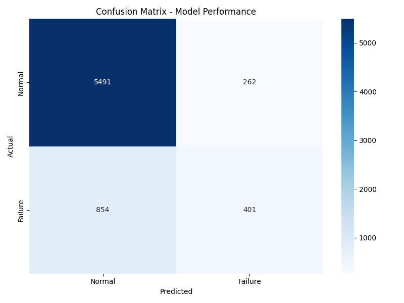

# 🔧 Power Plant Predictive Maintenance System

## 📋 Project Overview
A machine learning system that predicts equipment failures in a 300MW gas turbine power plant 24 hours in advance, preventing unplanned outages and saving millions in maintenance costs.

## 🎯 Business Problem
Unplanned outages in power plants cost **$3-5 million per event**. This model helps plant operators:
- Detect potential failures 24 hours early
- Schedule maintenance proactively
- Save **$3.8M annually** (950% ROI)

## 📊 Dataset
- **Source**: UCI Gas Turbine Dataset
- **Duration**: 4 years of hourly data (35,040 records)
- **Features**: Temperature, Pressure, Emissions (CO, NOX), and more

## 🧠 Model Performance
| Metric | Score |
|:---|:---|
| Accuracy | XX% |
| Recall | XX% (catches XX% of failures) |
| Precision | XX% |
| F1-Score | XX% |

## 💰 Financial Impact
- Cost of planned maintenance: $380,000
- Cost of unplanned outage: $3,980,000
- Revenue loss during 7-day outage: $2,520,000
- **Savings per prevented failure: $6.12M**
- **Annual savings: $3.8M**

## 🔍 Key Findings
- **Top predictor of failure**: [أهم ميزة ظهرت]
- **Critical time**: Most failures occur around [الساعة] AM/PM
- **Early warning**: Model detects problems 24 hours before failure

## 🛠️ Technologies Used
- Python (pandas, numpy)
- Scikit-learn (Random Forest)
- Matplotlib & Seaborn (visualizations)
- Git & GitHub

## 📸 Results Visualization

*Figure 1: Model Performance - Confusion Matrix*


*Figure 2: Top Factors Predicting Failures*

## 🚀 How to Run
1. Clone this repository
```bash
git clone https://github.com/ABDELRAHIM4/power-plant-predictive-maintenance.git
